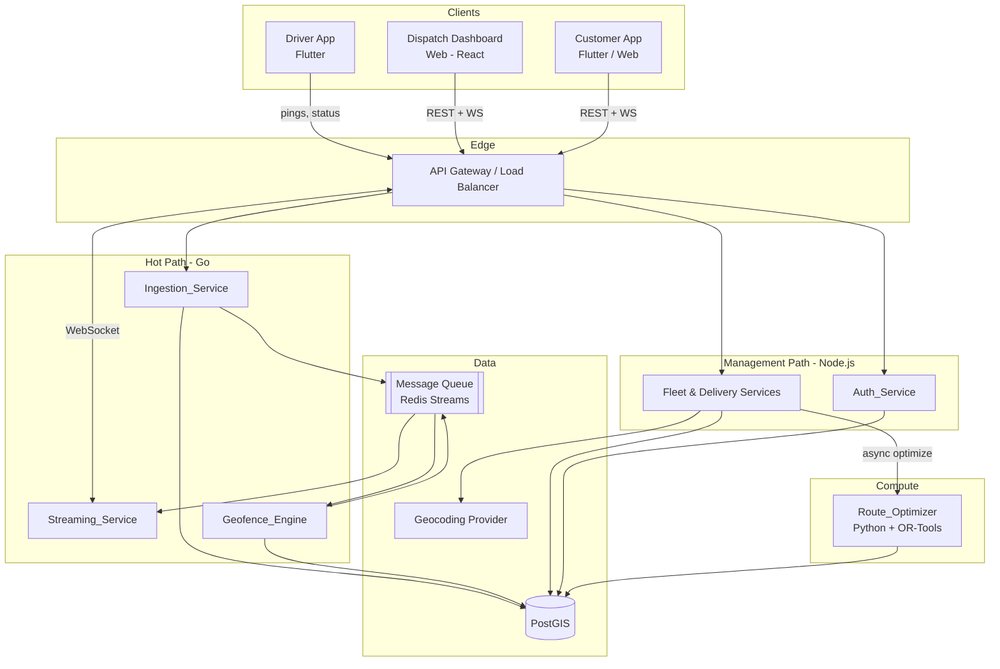
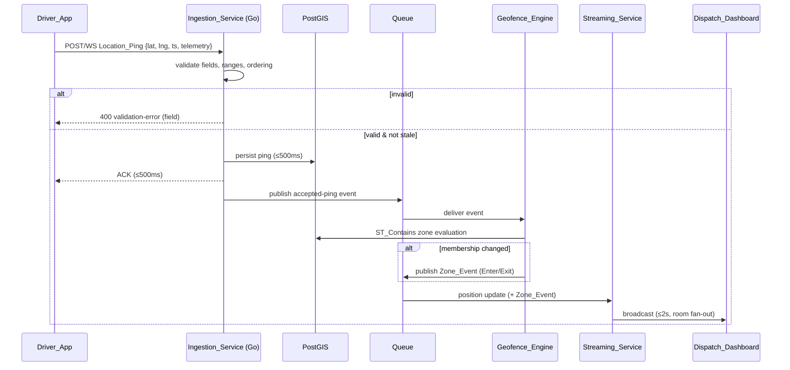
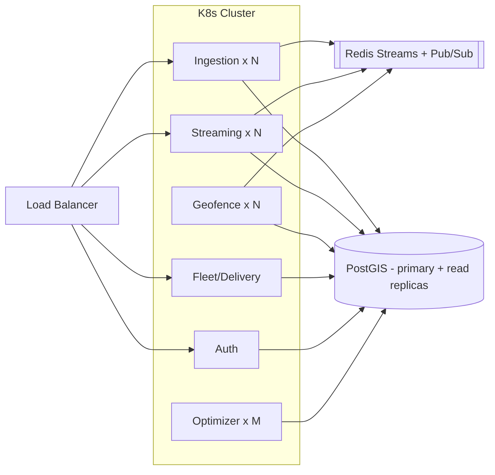
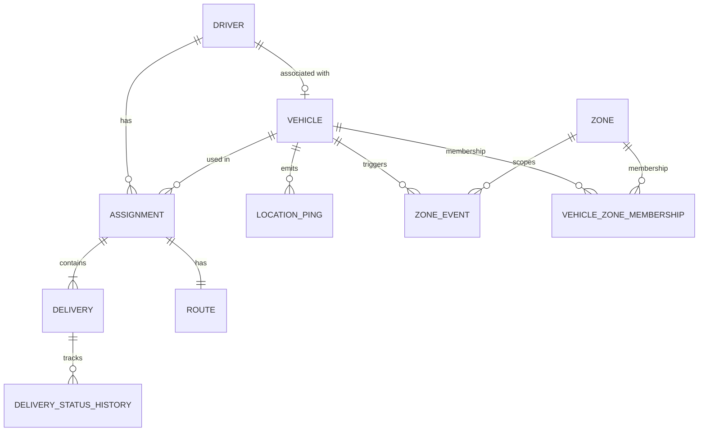
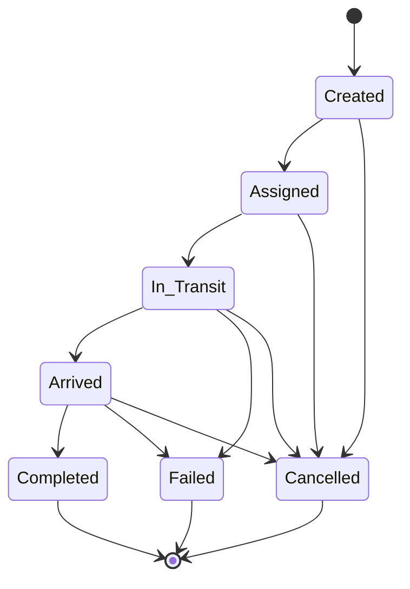
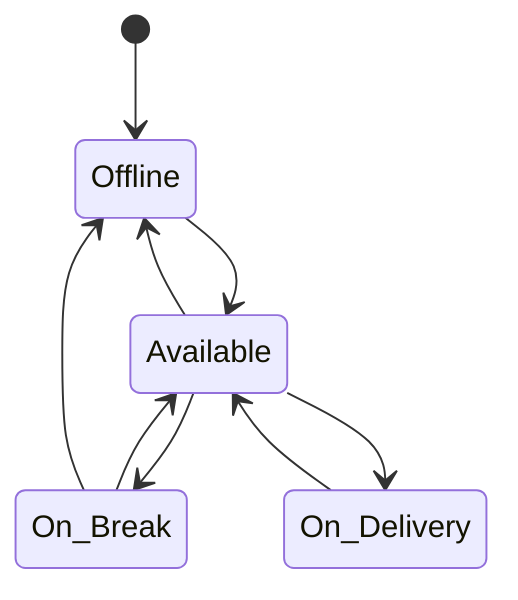
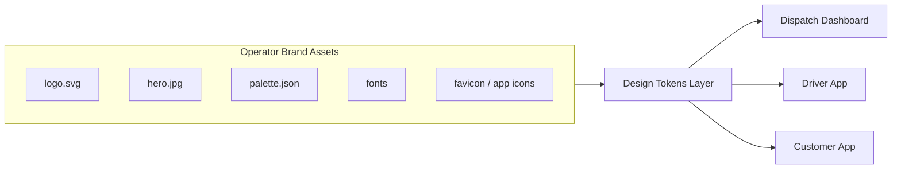
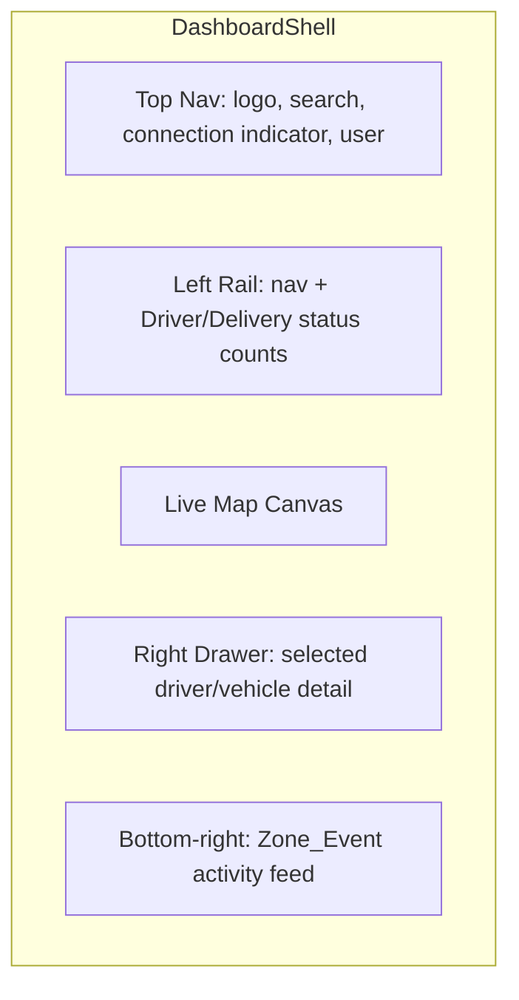

# Design Document

## Overview

Fleet Command Center is a logistics fleet-management platform composed of a set of backend services, a PostGIS data store, a real-time streaming layer, a Python route-optimization microservice, and three client surfaces (a web Dispatch Dashboard, a Flutter Driver App, and a Flutter Customer App).

The system's defining technical challenge is sustained high-frequency telemetry: thousands of `Location_Ping` events per second flowing in from driver devices, each of which must be validated, persisted, evaluated for geo-fence membership, and fanned out to live subscribers within tight latency bounds (≤500 ms to acknowledge ingestion, ≤2 s to broadcast to dashboards). To meet this, the design separates the **hot path** (Go ingestion + streaming, optimized for concurrency and throughput) from the **management path** (Node.js CRUD/admin services, optimized for developer velocity on lower-frequency operations) and the **compute path** (a stateless Python TSP optimizer invoked asynchronously).

### Key Design Decisions

| Concern | Decision | Rationale |
|---|---|---|
| Ingestion & streaming runtime | **Go** | Goroutine-per-connection concurrency model handles thousands of simultaneous pings/sockets with low memory overhead. |
| CRUD / admin services | **Node.js (NestJS)** | Lower-frequency operations (driver/vehicle/delivery management, RBAC) benefit from a fast-to-build, well-typed service layer. |
| Authoritative data store | **PostGIS (PostgreSQL + spatial)** | Mature spatial indexing (GiST), `ST_Contains`/`ST_DWithin` predicates for geo-fencing and stop grouping, and transactional integrity for the delivery lifecycle. |
| Real-time transport | **Socket.IO (WebSocket)** | Broad client support across browser and Flutter, room-based fan-out, built-in reconnection and resume semantics. |
| Route optimization | **Standalone Python service (OR-Tools)** | Google OR-Tools provides a robust TSP/VRP solver; isolating it keeps heavy CPU work off the hot path and lets it scale independently. |
| Geo-fencing | **Server-side PostGIS containment per accepted ping** | Single source of truth; avoids client drift; spatial index keeps per-ping evaluation cheap. |
| Hot-path buffering | **Message queue (Redis Streams / Kafka) between ingestion and downstream consumers** | Decouples persistence acknowledgement from geo-fence + broadcast work so ingestion stays available even if streaming is down (Req 14.5). |
| Geocoding | **External geocoding provider with a 10 s timeout** | Address-to-coordinate resolution for delivery creation (Req 7.3). |

### Research Notes

- **PostGIS spatial predicates**: Zone membership uses `ST_Contains(zone.geom, point)` combined with `ST_Touches` (boundary inclusion) so that "inside or on the boundary" counts as inside for Enter events while "strictly outside" is the complement (Req 6.3–6.5). Polygon validity is checked with `ST_IsValid` and `ST_IsClosed`, which detect self-intersection and unclosed rings (Req 6.2).
- **TSP solver**: Google OR-Tools `RoutingModel` solves the metric TSP for up to 50 stops well within the 30 s budget; the origin is fixed to the vehicle's current position (Req 9.1). Stop grouping uses a pre-clustering pass that merges destinations within 25 m via `ST_DWithin` before the solver runs (Req 9.8).
- **Socket.IO rooms**: Subscriptions map cleanly to rooms keyed by `vehicle:{id}` and `delivery:{id}`; reconnection with the same auth context rejoins prior rooms, satisfying resume-on-reconnect (Req 14.4).
- **Out-of-order handling**: Each vehicle tracks a high-water-mark timestamp; pings older than that mark are discarded without mutating stored state (Req 4.4), which also makes ingestion idempotent under replay.

## Architecture

### System Context



### Ingestion Hot Path (per Location_Ping)



### Deployment View



The hot-path services scale horizontally and are stateless except for in-memory per-vehicle high-water marks, which are backed by Redis so any ingestion replica can evaluate ordering. Streaming replicas share subscription fan-out through Redis Pub/Sub so a ping accepted on one node reaches sockets connected to another.

## Components and Interfaces

### Ingestion_Service (Go)

Receives, validates, and persists location pings; the entry point for the hot path.

Responsibilities:
- Validate presence of `latitude`, `longitude`, `timestamp` (Req 4.2).
- Validate coordinate ranges: lat ∈ [-90, 90], lng ∈ [-180, 180] (Req 4.3).
- Enforce per-vehicle monotonic ordering via high-water mark; discard stale pings (Req 4.4).
- Persist accepted pings with any telemetry within 500 ms and acknowledge (Req 4.1, 4.5, 4.7).
- Publish an `accepted-ping` event to the queue for downstream geo-fence + streaming.
- Remain available for persistence even when the Streaming_Service is down (Req 14.5).

Key interface:
```
POST /v1/pings            (also accepted over authenticated WebSocket)
  body: { vehicleId, lat, lng, timestamp, telemetry?: {speed?, heading?, battery?} }
  200:  { accepted: true, pingId }
  400:  { accepted: false, error: "validation-error", fields: ["latitude"] }
  409:  { accepted: false, error: "stale-ping" }   // discarded, prior retained
```

### Streaming_Service (Go + Socket.IO)

Broadcasts position updates and zone events to subscribed clients and manages connection lifecycle.

Responsibilities:
- Maintain subscriptions as rooms: `vehicle:{id}`, `delivery:{id}`, `dashboard:global` (Req 14.1).
- Broadcast position updates within 2 s of persistence (Req 5.2) and Zone_Events within 2 s (Req 6.6).
- Retry undelivered Zone_Events up to 3 times (Req 6.7).
- Support ≥1,000 concurrent clients (Req 14.2).
- Detect disconnects and release subscription resources (Req 14.3); resume prior subscriptions on reconnect (Req 14.4).
- Surface a connection-status signal clients use for the dashboard indicator (Req 5.6).

Key events:
```
client → server:  subscribe { kind: "vehicle"|"delivery", id }
                  unsubscribe { kind, id }
server → client:  position { vehicleId, lat, lng, timestamp, telemetry }
                  zoneEvent { vehicleId, zoneId, type: "Enter"|"Exit", label?, timestamp }
                  assignment { assignmentId, ... }      // to Driver_App
                  routeUpdate { assignmentId, stops[] }  // to Driver_App
```

### Geofence_Engine (Go)

Evaluates each accepted ping against zones and emits Enter/Exit events on membership change.

Responsibilities:
- For each accepted ping, compute current zone membership using PostGIS containment with boundary inclusion (Req 6.3, 6.4).
- Compare against the vehicle's previous membership set; emit `Enter` for newly-inside zones, `Exit` for newly-outside zones, and emit nothing when membership is unchanged (Req 6.5).
- Include a zone's arrival label in the event payload when configured (Req 6.8).
- Publish generated Zone_Events to the queue for streaming.

Internal interface (consumes queue events):
```
onAcceptedPing(vehicleId, point, timestamp) -> [ZoneEvent]
```

### Route_Optimizer (Python + OR-Tools)

Stateless microservice computing an optimized stop sequence for an assignment.

Responsibilities:
- Pre-cluster deliveries whose destinations are within 25 m into a single stop (Req 9.8).
- Solve the metric TSP from the vehicle's current location as origin for 2–50 deliveries (Req 9.1).
- Return a sequence covering every delivery exactly once (validated by caller, Req 9.3/9.4).
- Respect the 30 s timeout enforced by the caller (Req 9.5).

Interface:
```
POST /optimize
  body: { origin: {lat,lng}, stops: [{deliveryId, lat, lng}] }
  200:  { sequence: [deliveryId, ...], groups: [[deliveryId,...]] }
  503/timeout handled by caller → unoptimized fallback
```

### Auth_Service (Node.js)

Authenticates users and enforces role-based authorization.

Responsibilities:
- Authenticate credentials and issue session tokens (JWT) for Driver/Dispatcher/Administrator/Customer (Req 2.1, 13.1).
- Reject invalid credentials with a generic message that does not reveal which credential failed (Req 2.2).
- Expire tokens and require re-authentication (Req 2.6).
- Enforce the RBAC matrix on every protected request (Req 13.2–13.6).
- Customer tracking links resolve to a scoped, single-delivery capability token (Req 11.5, 13.6).

Interface:
```
POST /v1/auth/login        -> { token, role, expiresAt }
POST /v1/auth/refresh      -> { token, expiresAt }
GET  /v1/track/{linkToken} -> scoped delivery view
(middleware) authorize(role, action, resource) -> allow | 403 authorization-denied
```

### Fleet & Delivery Services (Node.js)

CRUD and lifecycle orchestration for drivers, vehicles, deliveries, assignments, routes, and zones.

Responsibilities:
- Driver onboarding/management with required-field and duplicate-email validation (Req 1).
- Driver status transitions, including system-driven `On_Delivery` (Req 2.3–2.5).
- Vehicle registration and driver association with duplicate/conflict checks (Req 3).
- Delivery creation with field validation and geocoding (Req 7.1–7.3), and lifecycle transition enforcement (Req 7.4–7.11).
- Assignment creation, notification, acceptance, reassignment (Req 8).
- Route creation, optimizer invocation, fallback, and re-optimization on change (Req 9).
- Zone definition with geometry validation (Req 6.1, 6.2).
- Historical queries and reporting (Req 16).

Representative endpoints:
```
POST   /v1/drivers            POST /v1/vehicles          POST /v1/zones
PATCH  /v1/drivers/{id}        POST /v1/deliveries        POST /v1/assignments
GET    /v1/drivers?status=     POST /v1/deliveries/{id}/transition
GET    /v1/deliveries/{id}/history    GET /v1/vehicles/{id}/track?from=&to=
GET    /v1/reports/summary?from=&to=
```

### Dispatch_Dashboard (Web — React + TypeScript)

The operations console. Renders the live map, fleet/delivery counts, activity feed, search, and driver detail. Modern branded UI (see Frontend Design System). Connects over REST for management actions and WebSocket for live updates.

### Driver_App (Flutter)

Authenticates drivers, manages availability, receives assignments/routes, transmits pings at ≤10 s intervals during active assignments (Req 10.5), queues up to 10,000 pings offline in chronological order (Req 4.8), and flushes them on reconnect within 60 s (Req 4.9). Provides navigation guidance and stop progress updates (Req 10).

### Customer_App (Flutter / Web)

Resolves a tracking link to a single delivery (Req 11.5), shows status and live vehicle position while In_Transit, arrival notification on destination-zone entry, and completion/cancellation states (Req 11).

## Data Models

All geospatial columns use PostGIS `geometry(..., 4326)` (WGS84). GeoJSON is used on the wire; geometry is stored natively for spatial indexing.

### Driver
```
id            UUID PK
name          text            (required)
email         text UNIQUE     (required)
phone         text            (required)
licenseNumber text            (required)
status        enum(Offline, Available, On_Delivery, On_Break)  default Offline
active        boolean         default true
createdAt     timestamptz
updatedAt     timestamptz
```

### Vehicle
```
id            UUID PK
identifier    text UNIQUE     (required)
type          text
capacityKg    numeric
driverId      UUID FK -> Driver (nullable; one active association)
associatedAt  timestamptz
createdAt     timestamptz
```

### Delivery
```
id            UUID PK
address       text (1..255)   (required)
recipientName text (1..100)   (required)
recipientContact text (1..50) (required)
weightKg      numeric (>0 and <=1000)  (required)
destination   geometry(Point, 4326)    (geocoded)
status        enum(Created, Assigned, In_Transit, Arrived, Completed, Failed, Cancelled)
failureReason text (1..500, nullable)
trackingToken text UNIQUE
assignmentId  UUID FK -> Assignment (nullable)
completedAt   timestamptz (nullable)
createdAt     timestamptz
updatedAt     timestamptz
```

### Delivery_Status_History
```
id            UUID PK
deliveryId    UUID FK -> Delivery
fromStatus    enum (nullable for creation)
toStatus      enum
reason        text (nullable)
occurredAt    timestamptz
```
Backs delivery history (Req 16.2) and 365-day retention (Req 16.1).

### Assignment
```
id            UUID PK
driverId      UUID FK -> Driver
vehicleId     UUID FK -> Vehicle
status        enum(Pending, Accepted, Complete)
acceptedAt    timestamptz (nullable)
createdAt     timestamptz
-- Deliveries reference assignmentId; an Assignment has 1..N Deliveries
```

### Route
```
id            UUID PK
assignmentId  UUID FK -> Assignment (unique)
stops         jsonb   -- ordered [{ stopIndex, deliveryIds:[...], lat, lng }]
optimized     boolean
currentStop   int
createdAt     timestamptz
updatedAt     timestamptz
```
`deliveryIds` is an array per stop to represent grouped co-located deliveries (Req 9.8).

### Zone
```
id            UUID PK
name          text (1..100)   (required)
geom          geometry(Polygon, 4326)  -- validated closed, simple, 3..1000 vertices
arrivalLabel  text (1..100, nullable)
createdAt     timestamptz
GIST index on geom
```

### Location_Ping
```
id            UUID PK
vehicleId     UUID FK -> Vehicle
driverId      UUID FK -> Driver
geom          geometry(Point, 4326)
timestamp     timestamptz     (event time)
receivedAt    timestamptz     (server time)
speed         numeric (nullable)
heading       numeric (nullable)
battery       numeric (nullable)
GIST index on geom; btree index on (vehicleId, timestamp)
```
Per-vehicle high-water mark (max accepted `timestamp`) maintained in Redis for O(1) ordering checks.

### Zone_Event
```
id            UUID PK
vehicleId     UUID FK -> Vehicle
zoneId        UUID FK -> Zone
type          enum(Enter, Exit)
label         text (nullable)   -- from Zone.arrivalLabel
occurredAt    timestamptz
deliveredAt   timestamptz (nullable)
deliveryAttempts int default 0
```

### Vehicle_Zone_Membership (working state)
```
vehicleId     UUID
zoneId        UUID
inside        boolean
updatedAt     timestamptz
PK (vehicleId, zoneId)
```
Holds the previous membership the Geofence_Engine compares against to decide Enter/Exit/no-event.

### Entity Relationships



### State Machines

Delivery lifecycle (Req 7):


Driver status (Req 2):


## Frontend Design System

The frontend is intentionally custom-designed and brand-forward — the goal is a polished operations product, not a generic admin template. The Dispatch Dashboard is built with React + TypeScript; the Driver and Customer apps are Flutter. All three share a single source of design tokens so branding stays consistent (Req 15.2).

### Design Token Architecture

Tokens are defined once (as CSS custom properties for web, and a Dart `ThemeData`/token map for Flutter) and consumed everywhere. Operator-provided palette values override the neutral defaults below; until they are supplied, the neutral placeholder set is used so nothing renders broken (Req 15.5).

**Color tokens (neutral placeholder defaults — replaced by operator palette):**
```
--color-bg            #0F1419   (app shell, dark operations theme)
--color-surface       #1A2230   (cards, panels)
--color-surface-alt   #232E40
--color-border        #2E3A4E
--color-text          #E8EDF4
--color-text-muted    #9AA7B8
--color-primary       #3B82F6   (brand primary — operator override)
--color-primary-hover #2E6FD6
--color-accent        #14B8A6   (secondary actions, live indicators)
--color-success       #22C55E   (Available, Completed)
--color-warning       #F59E0B   (On_Break, Arrived)
--color-danger        #EF4444   (Failed, disconnect, Offline)
--color-info          #38BDF8   (In_Transit, Zone Enter)
```
Status colors map directly to `Driver_Status` and `Delivery_Status` so the map, badges, and counts read consistently.

**Typography:**
```
--font-sans   "Inter", system-ui, sans-serif    (UI)
--font-mono   "JetBrains Mono", monospace        (IDs, coordinates, timestamps)
Scale (1.25 ratio): 12 / 14 / 16 / 20 / 25 / 31 / 39 px
Weights: 400 body, 500 medium, 600 semibold (headings), 700 emphasis
Line-height: 1.5 body, 1.2 headings
```
A WCAG contrast check is part of the token definition: text-on-surface combinations are chosen to meet ≥4.5:1 for body and ≥3:1 for large text and interactive boundaries (Req 15.6). Final validation requires manual testing with assistive technologies and accessibility review.

**Spacing & radius (4px base grid):**
```
space: 4, 8, 12, 16, 24, 32, 48, 64
radius: 6 (controls), 10 (cards), 16 (modals), 9999 (pills/avatars)
shadow: sm/md/lg elevation tokens for panels and popovers
```

### Component Library

Shared primitives styled from tokens: `Button` (primary/secondary/ghost/danger), `Input`/`Select`/`FormField` with inline validation messaging, `Badge` (status-colored), `Card`/`Panel`, `Modal`, `Toast`, `Table` (sortable/filterable), `Tabs`, `Tooltip`, `ConnectionIndicator`, `StatCard`, `ActivityFeedItem`, `MapMarker`, `MapPathTrace`.

### Branding Integration



- The Dashboard renders the operator logo in the primary navigation/sidebar header (Req 15.1). Until provided, a neutral wordmark placeholder ("Fleet Command Center" set in `--font-sans` 600 on a tokened tile) is shown.
- The Customer App displays hero imagery on its landing and tracking-entry screens when supplied (Req 15.3); a tokened gradient placeholder fills the hero region otherwise.
- A `BrandProvider` loads `palette.json` at runtime and maps it onto the color tokens, so swapping branding requires no code changes.

**Brand assets needed from the operator** (each has a working placeholder until delivered):
1. **Logo** — primary (horizontal, light + dark variants) and a square mark, ideally SVG.
2. **Hero imagery** — landscape image(s) for Customer App landing/tracking entry (≥1920×1080, JPG/WebP).
3. **Color palette** — primary, accent, and any neutral overrides (hex), as `palette.json`.
4. **Typography** — brand font files or named web fonts + license; otherwise Inter/JetBrains Mono defaults stand.
5. **App icons & favicon** — for Flutter apps and the web dashboard.
6. **Optional**: marker/pin iconography and an empty-state illustration set.

### Live Map UI with Path Tracing



- The map (MapLibre GL / Mapbox GL) renders every active vehicle as a status-colored, heading-rotated marker (Req 5.1). Position updates arrive over WebSocket and animate marker transitions within 2 s (Req 5.2).
- Selecting a vehicle traces a `Path_Trace` polyline through its chronological pings for at least the last 60 minutes, fetched once from history then extended live (Req 5.3, 5.4). The trace uses `--color-info` with a fade toward older segments.
- Filter controls by `Driver_Status` and `Zone` reduce the rendered marker set (Req 5.5).
- A persistent `ConnectionIndicator` shows live/reconnecting/offline state and auto-reconnect progress when the socket drops (Req 5.6).
- Zones render as translucent polygons; Zone_Events stream into the activity feed within 2 s (Req 12.4).

### Responsive Layout

The Dashboard targets desktop operations use and remains fully usable at viewport widths ≥1280 px (Req 15.4): a three-zone layout (left rail, map, right detail drawer) at ≥1280 px, with the detail drawer collapsing to an overlay between 1280–1440 px. The Flutter apps use adaptive layouts for phone and tablet form factors. All interactive targets meet a ≥44px touch target on mobile and AA contrast (Req 15.6).

## Correctness Properties

*A property is a characteristic or behavior that should hold true across all valid executions of a system — essentially, a formal statement about what the system should do. Properties serve as the bridge between human-readable specifications and machine-verifiable correctness guarantees.*

These properties are derived from the acceptance-criteria prework and consolidated to remove redundancy. They target the system's pure logic (validation, state machines, geo-fence transitions, optimization handling, aggregation, scoping). Timing/load/external-service criteria are covered by integration and performance tests in the Testing Strategy, not by properties.

### Property 1: Driver creation initializes to Offline

*For any* valid driver record, creating the driver persists it and yields `Driver_Status == Offline`.

**Validates: Requirements 1.1**

### Property 2: Required-field validation rejects and reports offending fields without persisting

*For any* create request for a driver (Req 1.2), location ping (Req 4.2), zone (Req 6.2), or delivery (Req 7.2) that omits/empties a required field — or carries an out-of-range value (ping coordinates Req 4.3; delivery weight outside `(0, 1000]` Req 7.2; zone polygon vertex count outside `[3, 1000]`, unclosed, or self-intersecting Req 6.2) — the System rejects the request, returns a message naming exactly the offending field(s), and persists no part of the record.

**Validates: Requirements 1.2, 4.2, 4.3, 6.2, 7.2**

### Property 3: Unique-key constraints reject duplicates

*For any* existing driver email (Req 1.3) or vehicle identifier (Req 3.2), a subsequent create with the same key is rejected with a duplicate message and the original record is unchanged.

**Validates: Requirements 1.3, 3.2**

### Property 4: Updates persist and advance the update timestamp

*For any* update to a driver record, the changed fields are persisted and `updatedAt` is strictly greater than the prior value.

**Validates: Requirements 1.4**

### Property 5: Deactivated and unavailable drivers cannot receive assignments

*For any* driver that is deactivated (Req 1.5) or whose status is `Offline` or `On_Break` (Req 2.4, 8.2), an attempt to create an assignment for that driver is rejected and the driver's eligibility is false.

**Validates: Requirements 1.5, 2.4, 8.2**

### Property 6: Status filters and listings return exactly the matching set

*For any* driver population and any `Driver_Status` filter, the returned list contains exactly the drivers with that status (Req 1.6); *for any* vehicle population, the listing returns every vehicle paired with its current driver association (Req 3.5).

**Validates: Requirements 1.6, 3.5**

### Property 7: Valid credentials authenticate; invalid credentials fail indistinguishably

*For any* registered user, correct credentials yield a session token carrying the user's role (Req 2.1, 13.1); *for any* invalid attempt, whether the username or the password is wrong, the rejection response is identical and reveals nothing about which credential failed (Req 2.2).

**Validates: Requirements 2.1, 2.2, 13.1**

### Property 8: Expired tokens are rejected until re-authentication

*For any* expired session token, requests are rejected until a fresh token is issued via re-authentication.

**Validates: Requirements 2.6**

### Property 9: Driver availability transitions reflect eligibility

*For any* authenticated driver, setting status to `Available` makes the driver eligible for assignments, and a driver with an in-progress assignment has status `On_Delivery`.

**Validates: Requirements 2.3, 2.5**

### Property 10: A vehicle has at most one active driver association

*For any* vehicle already actively associated with a driver, a new association to a different driver is rejected with a conflict; an accepted association records the effective timestamp.

**Validates: Requirements 3.3, 3.4**

### Property 11: Per-vehicle ping ordering is monotonic; stale pings are discarded

*For any* sequence of location pings for a vehicle, the persisted latest ping is the one with the maximum accepted timestamp, and any ping whose timestamp is older than the current per-vehicle high-water mark is discarded without altering stored state.

**Validates: Requirements 4.4**

### Property 12: Accepted pings persist with their included telemetry (round-trip)

*For any* valid ping with an arbitrary subset of telemetry fields, persisting then reading the ping returns the same coordinates, timestamp, and telemetry values, linked to the correct vehicle and driver.

**Validates: Requirements 4.1, 4.5**

### Property 13: Offline ping queue is bounded and chronological

*For any* sequence of pings enqueued offline, the Driver_App queue holds at most 10,000 pings, retains the most recent 10,000 in chronological order (dropping the oldest when full), and on flush transmits the queued pings in chronological order.

**Validates: Requirements 4.8, 4.9**

### Property 14: Path trace is chronological and windowed

*For any* selected vehicle's ping history, the rendered `Path_Trace` orders the pings chronologically and includes every ping within the most recent 60 minutes.

**Validates: Requirements 5.3, 5.4**

### Property 15: Live map shows exactly the vehicles matching the active view/filter

*For any* set of vehicles, the map renders a marker for every active vehicle when unfiltered (Req 5.1), and exactly the vehicles matching an applied `Driver_Status`/`Zone` filter when filtered (Req 5.5).

**Validates: Requirements 5.1, 5.5**

### Property 16: Geo-fence events fire if and only if membership changes

*For any* zone and any consecutive pair of accepted pings for a vehicle, the Geofence_Engine generates an `Enter` event exactly when the vehicle moves from outside to inside-or-on-boundary, an `Exit` event exactly when it moves from inside to strictly outside, and no event when membership is unchanged.

**Validates: Requirements 6.3, 6.4, 6.5**

### Property 17: Valid zone geometry round-trips

*For any* valid polygon (closed, simple, 3–1,000 vertices) and name of 1–100 characters, persisting then reading the zone returns an equivalent geometry.

**Validates: Requirements 6.1**

### Property 18: Zone-event payload carries the arrival label iff configured

*For any* generated zone event, the payload includes the zone's arrival label when the zone has one configured and omits it otherwise.

**Validates: Requirements 6.8**

### Property 19: Undelivered zone events are retained and retried up to three times

*For any* number K of consecutive delivery failures for a zone event, the Streaming_Service retains the event and retries delivery `min(K, 3)` times before giving up, never exceeding 3 retries.

**Validates: Requirements 6.7**

### Property 20: Delivery lifecycle honors only defined transitions

*For any* delivery and any sequence of transition requests, the System applies a transition only if it is defined in the lifecycle (including: cancellation permitted from `Created`/`Assigned`/`In_Transit`/`Arrived`), and rejects any undefined or terminal-state transition (cancel from `Completed`/`Failed`/`Cancelled`) with an invalid-transition message while retaining the current status.

**Validates: Requirements 7.4, 7.5, 7.6, 7.9, 7.10, 7.11, 10.3, 10.4**

### Property 21: Terminal transitions record their side effects

*For any* delivery transitioning to `Completed`, a completion timestamp is recorded; *for any* delivery transitioning to `Failed` with a reason of 1–500 characters, the reason is persisted.

**Validates: Requirements 7.7, 7.8**

### Property 22: Assignment creation links deliveries to the available driver and vehicle

*For any* available driver with an associated vehicle and a set of unassigned deliveries, creating an assignment links every delivery to that driver and vehicle and records each delivery as assigned.

**Validates: Requirements 8.1**

### Property 23: A delivery belongs to at most one active assignment

*For any* delivery already in an active assignment, a new assignment including it is rejected as already-assigned (Req 8.3); *for any* reassignment, the delivery is removed from the original assignment and appears exactly once in the new assignment (Req 8.6).

**Validates: Requirements 8.3, 8.6**

### Property 24: Assignment acceptance records its timestamp

*For any* assignment a driver accepts, the acceptance timestamp is recorded.

**Validates: Requirements 8.5**

### Property 25: Route optimization is requested for 2–50 deliveries and falls back beyond the limit

*For any* assignment with 2–50 deliveries, the System requests an optimized sequence using the vehicle's current location as origin (Req 9.1); *for any* assignment with more than 50 deliveries, the System creates a route in assigned order, flags it unoptimized, and returns an over-limit message (Req 9.2).

**Validates: Requirements 9.1, 9.2**

### Property 26: Route construction trusts only valid optimizer output

*For any* optimizer response, the System builds the route in the returned order only if that sequence includes every delivery in the assignment exactly once (Req 9.3); if the sequence omits a delivery, includes a foreign one, or duplicates one, or if the optimizer fails to respond within the deadline, the System discards it and builds the route in assigned order flagged unoptimized (Req 9.4, 9.5).

**Validates: Requirements 9.3, 9.4, 9.5**

### Property 27: Changing an assignment's delivery set triggers re-optimization

*For any* change to the set of deliveries in an assignment, the System clears the unoptimized flag and requests a new optimized sequence.

**Validates: Requirements 9.6**

### Property 28: Co-located destinations are grouped into a single stop

*For any* set of delivery destinations, destinations within 25 meters of one another are grouped into the same route stop, and destinations farther apart than 25 meters are not grouped solely by proximity.

**Validates: Requirements 9.8**

### Property 29: A route whose stops are all terminal completes the assignment and frees the driver

*For any* route, once every stop reaches a terminal delivery status, the assignment is marked complete and the driver's status becomes `Available`.

**Validates: Requirements 10.6**

### Property 30: Tracking views reflect delivery state

*For any* delivery, opening its tracking link displays its current status (Req 11.1); when the delivery is `Completed`, the view shows a completion confirmation and hides live position (Req 11.4); when it is `Cancelled`, the view shows a cancellation notice (Req 11.6).

**Validates: Requirements 11.1, 11.4, 11.6**

### Property 31: Destination-zone entry notifies the delivery's customer

*For any* `Enter` event generated for a vehicle entering a delivery's destination zone, an arrival notification is routed to that delivery's customer only.

**Validates: Requirements 11.3**

### Property 32: Resource access is restricted to owners and link scope

*For any* tracking link, only the delivery associated with that link is accessible (Req 11.5, 13.6); *for any* driver, only assignments and deliveries linked to that driver are accessible (Req 13.5).

**Validates: Requirements 11.5, 13.5, 13.6**

### Property 33: Status counts equal actual grouped counts

*For any* driver and delivery population, the dashboard's per-status counts equal the true number of drivers/deliveries in each status.

**Validates: Requirements 12.1, 12.2**

### Property 34: Delivery search returns exactly the matching deliveries

*For any* set of deliveries and any search query, searching by identifier or recipient returns exactly the deliveries whose identifier or recipient matches the query, each with its current status.

**Validates: Requirements 12.5**

### Property 35: Authorization follows the role permission matrix

*For any* (role, action) pair, the request is permitted if and only if the pair is allowed by the defined RBAC matrix — only Administrators may create/update/deactivate driver, vehicle, and zone records (Req 13.3); only Administrators and Dispatchers may create deliveries and assignments (Req 13.4) — otherwise the request is denied with an authorization-denied response.

**Validates: Requirements 13.2, 13.3, 13.4**

### Property 36: Subscriptions deliver exactly the relevant updates and survive reconnect

*For any* client subscription to a set of vehicles or a delivery, the Streaming_Service delivers every relevant subsequent update and no irrelevant one (Req 14.1); on disconnect it releases the subscription resources (Req 14.3); and on reconnect it restores the client's prior subscriptions (Req 14.4).

**Validates: Requirements 14.1, 14.3, 14.4**

### Property 37: Ingestion persists pings even when streaming is unavailable

*For any* valid ping received while the Streaming_Service is unavailable, the Ingestion_Service still persists and acknowledges the ping.

**Validates: Requirements 14.5**

### Property 38: Branding renders an asset or a defined placeholder, never a broken element

*For any* combination of present/absent brand assets, every branding slot (logo, hero) renders either the supplied asset or its defined neutral placeholder, with no broken or missing visual element.

**Validates: Requirements 15.5**

### Property 39: Token color pairs meet WCAG AA contrast thresholds

*For any* defined text/background token pairing used by the design system, the computed contrast ratio is at least 4.5:1 for normal text and at least 3:1 for large text and interactive boundaries. (Full WCAG conformance also requires manual assistive-technology testing.)

**Validates: Requirements 15.6**

### Property 40: History and range queries return exactly the in-range records, ordered

*For any* delivery, requesting its history returns its status transitions ordered by time with timestamps (Req 16.2); *for any* vehicle and time range, the track returns exactly the pings within that range in chronological order (Req 16.3); *for any* date range, the summary returns the true counts of `Completed`, `Failed`, and `Cancelled` deliveries in that range (Req 16.4).

**Validates: Requirements 16.2, 16.3, 16.4**

## Error Handling

### Validation Errors (client-correctable, 400)
- Missing/empty required fields, out-of-range coordinates or weights, and invalid zone geometry return a structured `{ error, fields: [...] }` payload naming each offending field; nothing is persisted (Req 1.2, 4.2, 4.3, 6.2, 7.2). Geometry validation runs `ST_IsValid`/`ST_IsClosed` and vertex-count checks before any insert.

### Conflict & Invalid-State Errors (409 / 422)
- Duplicate email/identifier (Req 1.3, 3.2), vehicle association conflict (Req 3.4), already-assigned delivery (Req 8.3), and invalid lifecycle transitions (Req 7.10, 7.11) return specific conflict/invalid-transition messages and leave state unchanged. Lifecycle transitions are guarded by a central transition table; any (state, event) not in the table is rejected.

### Stale / Out-of-Order Data
- Pings older than the per-vehicle high-water mark are silently discarded (acknowledged as `stale-ping`, no error surfaced to the user) and the latest persisted ping is retained (Req 4.4).

### External-Dependency Failures
- **Geocoding** failure or 10 s timeout rejects delivery creation with a geocoding-failure message; nothing is persisted (Req 7.3).
- **Route_Optimizer** invalid output or 30 s timeout triggers the unoptimized fallback route in assigned order (Req 9.4, 9.5); the failure is logged but does not block assignment.
- **Streaming_Service** unavailability never blocks ingestion: pings are persisted and queued for later fan-out (Req 14.5). Undelivered zone events are retained and retried up to 3 times (Req 6.7).

### Authentication & Authorization Failures
- Invalid credentials return a single generic message regardless of which credential failed (Req 2.2). Expired tokens return 401 prompting re-authentication (Req 2.6). Permission/ownership violations return 403 authorization-denied (Req 13.2, 13.5, 13.6).

### Connectivity & Resilience
- Driver_App buffers up to 10,000 pings offline and flushes them in order on reconnect (Req 4.8, 4.9). Dashboard/customer sockets show a connection indicator and auto-reconnect, resuming prior subscriptions (Req 5.6, 14.4). Disconnect detection releases subscription resources to prevent leaks (Req 14.3).

### Observability
- Structured logging, request tracing across the hot path, and metrics on ingestion rate, ack latency, broadcast latency, optimizer duration, and queue depth support the latency and throughput requirements (Req 4.6, 4.7, 5.2, 14.2).

## Testing Strategy

The system uses a dual approach: **property-based tests** verify the universal properties above across many generated inputs, and **example/integration/performance tests** cover concrete scenarios, external services, timing, and load that are not amenable to property-based testing.

### Property-Based Testing

PBT applies broadly here because the core logic — input validation, the delivery state machine, geo-fence transitions, ping ordering, route-output validation, spatial clustering, aggregation, search/filter, and RBAC — consists of pure functions with universal properties over large input spaces.

- **Libraries by language**: Go services use `gopter` (or `rapid`); Node.js services use `fast-check`; the Python optimizer-handling logic uses `Hypothesis`; the React dashboard logic (filters, trace ordering, counts, contrast) uses `fast-check`.
- Each correctness property (1–40) is implemented as a **single** property-based test.
- Each property test runs a **minimum of 100 iterations**.
- Each test is tagged with a comment referencing its design property in the format:
  `Feature: fleet-command-center, Property {number}: {property_text}`
- Generators must exercise edge cases inline: coordinate boundaries (±90, ±180), weight boundaries (0, 1000), zone vertex bounds (3, 1000), boundary-of-polygon points for geo-fencing, whitespace/empty strings for required fields, non-ASCII text, near-25m destination pairs, and shuffled/duplicate timestamps.
- External dependencies (geocoder, optimizer, streaming transport, clock) are **mocked** in property tests so logic is exercised cheaply at 100+ iterations (e.g., Property 19 retry counts, Property 26 optimizer timeout, Property 37 streaming-down).

### Example-Based Unit Tests

Focused tests for criteria better expressed as concrete scenarios:
- Connection-lost indicator + auto-reconnect behavior (Req 5.6).
- Next-stop navigation guidance launch (Req 10.2).
- Driver-detail panel rendering of assignment/route/position (Req 12.3).
- Logo-in-nav and hero-imagery rendering, with and without assets (Req 15.1, 15.3).

### Integration Tests (1–3 representative examples each)

For external-service and cross-service behavior where input variation adds little value:
- Geocoding rejection/timeout path (Req 7.3) against a stubbed provider.
- Optimizer end-to-end with the real Python service for a small assignment (Req 9.1, 9.7).
- Zone-event broadcast reaching a subscribed dashboard client and activity feed (Req 6.6, 12.4).
- Customer live-position update on In_Transit deliveries (Req 11.2).
- Assignment notification reaching the Driver_App (Req 8.4).
- Subscription resume after reconnect across streaming replicas (Req 14.4).

### Performance & Load Tests

For throughput and latency requirements that property tests do not address:
- Sustained 5,000 pings/s ingestion with all valid pings persisted (Req 4.6) and ack latency ≤500 ms (Req 4.1, 4.7).
- Broadcast latency ≤2 s under live load (Req 5.2, 6.6, 12.4).
- ≥1,000 concurrent streaming clients receiving updates (Req 14.2).
- Driver_App offline flush completing within 60 s (Req 4.9) and active-assignment ping cadence ≤10 s (Req 10.5).

### Smoke / Visual & Configuration Tests

- Design-token application across components and responsive layout at ≥1280 px (Req 15.2, 15.4) via snapshot/visual-regression tests.
- Retention configuration verifying completed/failed deliveries persist ≥365 days (Req 16.1).

### Accessibility Testing

- Automated contrast checks on token pairs (Property 39, Req 15.6) plus manual assistive-technology testing and expert accessibility review for full WCAG 2.1 AA conformance, which automated checks alone cannot guarantee.
