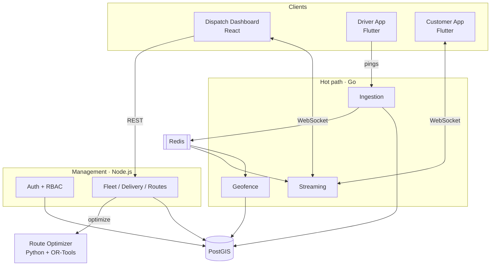

<div align="center">

# Fleet Command Center

**Real-time logistics fleet management — live vehicle tracking, geo-fencing, and multi-stop route optimization.**

[](apps/dashboard)
[](services)
[](services/optimizer)
[](apps)
[](docker-compose.yml)
[](LICENSE)

</div>

> **Live demo:** _deployed dashboard URL added after first deploy._ The hosted dashboard runs on seeded fleet data so the live map, path tracing, and operations console are explorable without a backend.

---

## Overview

Fleet Command Center is a logistics platform for tracking vehicles, managing drivers and deliveries, and giving customers live delivery tracking. It ingests high-frequency location pings from driver devices, streams positions to a live map with path tracing, triggers zone-based events through geo-fencing, and optimizes multi-stop delivery routes.

The system is built around three workload profiles, each on the runtime best suited to it:

- **Hot path (Go)** — sustained ingestion of thousands of location pings per second, geo-fence evaluation, and real-time fan-out, with tight latency bounds (≤500 ms ingest acknowledgement, ≤2 s broadcast).
- **Management path (Node.js / NestJS)** — lower-frequency CRUD and orchestration: authentication, role-based access control, the delivery lifecycle state machine, assignments, and reporting.
- **Compute path (Python / OR-Tools)** — a stateless microservice that solves the multi-stop (Traveling Salesman) routing problem.

## Features

- **Live fleet map** — vehicles rendered as status-coloured, heading-aware markers that update in real time, with a selectable 60-minute path trace.
- **Geo-fencing** — server-side PostGIS containment generates Enter/Exit zone events (e.g. "Arrived at warehouse") with at-most-once-per-transition semantics.
- **Delivery lifecycle** — a guarded state machine (Created → Assigned → In Transit → Arrived → Completed / Failed / Cancelled) that rejects invalid transitions.
- **Route optimization** — OR-Tools solves the metric TSP for up to 50 stops, clusters co-located destinations within 25 m, and falls back gracefully on timeout.
- **Real-time streaming** — room-keyed subscriptions over WebSocket with auto-reconnect, subscription resume, and Redis pub/sub fan-out across replicas.
- **Role-based access control** — Administrator, Dispatcher, Driver, and Customer roles, plus scoped customer tracking links.
- **Branded, token-driven UI** — a single source of design tokens shared across the web dashboard and both Flutter apps, with runtime palette overrides.

## Architecture



## Tech stack

| Layer | Technology |
|---|---|
| Web dashboard | React, TypeScript, Vite, MapLibre GL |
| Mobile apps | Flutter (Dart) |
| Ingestion / geofence / streaming | Go |
| Management services | Node.js, NestJS |
| Route optimizer | Python, FastAPI, Google OR-Tools |
| Data | PostgreSQL + PostGIS, Redis |
| Shared | TypeScript contracts, design tokens (CSS + Dart) |

## Monorepo layout

```
services/
  ingestion      Go      Location-ping ingestion, validation, ordering
  geofence       Go      PostGIS zone containment, Enter/Exit events
  streaming      Go      WebSocket rooms, broadcast, reconnect/resume
  management     Node    Auth, RBAC, fleet, delivery lifecycle, routes, reporting
  optimizer      Python  OR-Tools TSP route optimizer (FastAPI)
apps/
  dashboard      React   Dispatch / admin web console
  driver         Flutter Driver mobile app
  customer       Flutter Customer tracking app
packages/
  contracts      Shared DTOs, enums, socket event types
  design-tokens  Shared color/typography/spacing tokens (web + Flutter)
```

## Getting started

### Prerequisites

- Node.js 20+
- Go 1.22+
- Python 3.11+
- Flutter 3.19+
- Docker (for PostGIS + Redis)

### 1. Start data dependencies

```bash
docker compose up -d   # PostgreSQL/PostGIS + Redis
```

### 2. Install and build the TypeScript workspaces

```bash
npm install
npm run build -w @fleet/contracts
npm run build -w @fleet/design-tokens
```

### 3. Run the web dashboard

```bash
npm run dev -w @fleet/dashboard
```

The dashboard ships with seeded fleet data, so the live map and operations console render immediately. Point it at a running streaming service with `VITE_STREAMING_URL`.

### 4. Run the services

```bash
# Go hot path
go run ./services/ingestion
go run ./services/geofence
go run ./services/streaming

# Management (Node)
npm run start -w @fleet/management

# Optimizer (Python)
cd services/optimizer && uvicorn optimizer.main:app --reload
```

### 5. Run the mobile apps

```bash
cd apps/driver   && flutter run
cd apps/customer && flutter run
```

## Testing

The codebase pairs **property-based tests** for pure logic (validation, the delivery state machine, geo-fence transitions, ping ordering, route construction, RBAC, aggregation) with example, integration, performance, and accessibility tests.

```bash
# Management (Node) — unit + property tests
npm test -w @fleet/management

# Web dashboard — logic + render tests
npm test -w @fleet/dashboard

# Go services
go test ./...                          # run inside each service directory

# Optimizer (Python)
cd services/optimizer && pytest

# Flutter apps
cd apps/driver && flutter test
cd apps/customer && flutter test
```

Property-based tests run a minimum of 100 generated cases each and cover the platform's core correctness guarantees end to end.

## Branding

The UI is driven entirely by shared design tokens. To apply operator branding, replace `apps/dashboard/public/palette.json` with your colours and drop in your logo, hero imagery, fonts, and app icons. Until then, neutral placeholders keep every surface intact.

## Deployment

The dispatch dashboard is a static Vite build and deploys to Vercel from the repo root:

```bash
npm run vercel-build      # builds contracts → design-tokens → dashboard
# output: apps/dashboard/dist
```

Configuration lives in `vercel.json`.

## License

[MIT](LICENSE)
